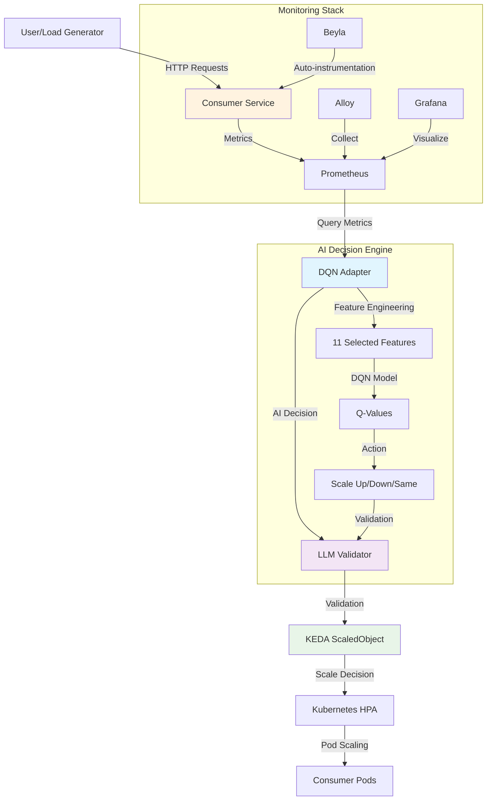
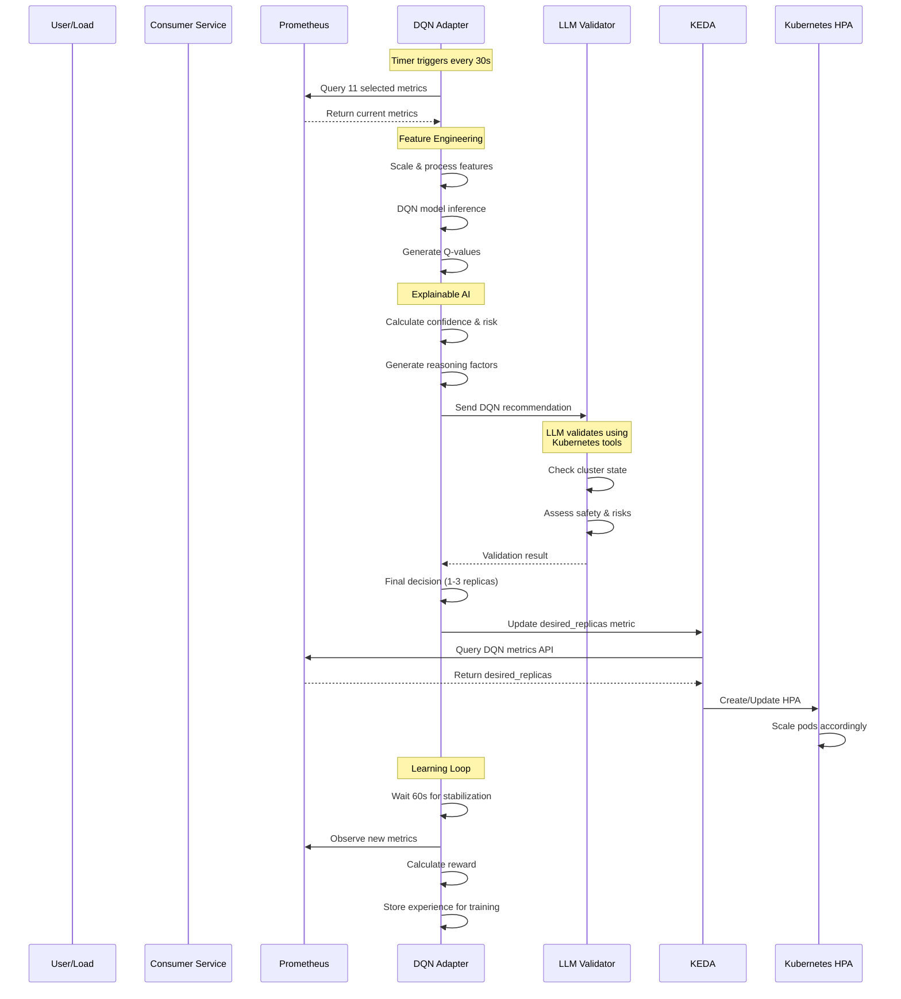
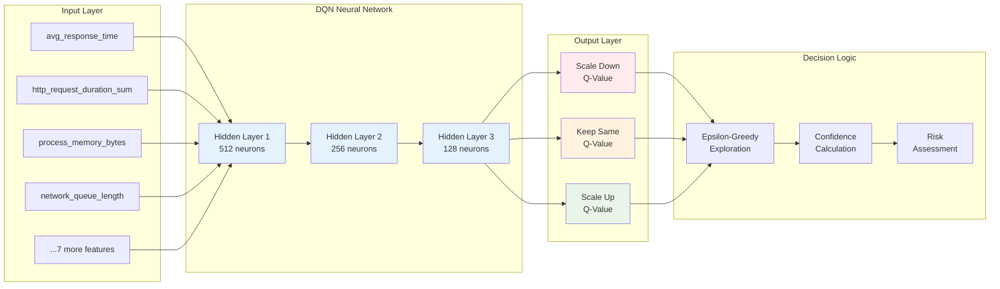
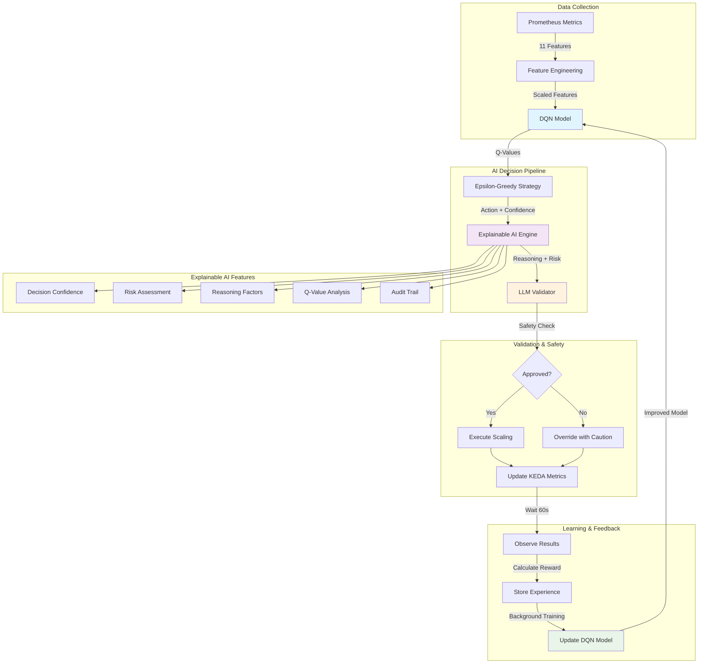

# NimbusGuard - AI-Powered Kubernetes Autoscaling

An intelligent cloud-native autoscaling system that uses **Deep Q-Learning (DQN)** and **Large Language Model (LLM) validation** to make smart scaling decisions for Kubernetes workloads.

## 🧠 What Makes NimbusGuard Special?

Unlike traditional autoscaling that relies on simple CPU/memory thresholds, NimbusGuard uses:
- **🤖 AI Decision Engine**: DQN neural network trained on 11 scientifically selected features
- **🛡️ LLM Safety Validator**: GPT-powered validation of scaling decisions
- **📊 Explainable AI**: Detailed reasoning for every scaling decision
- **🔄 Continuous Learning**: Real-time model improvement from system feedback

---

## 🏗️ System Architecture



---

## 🔄 Intelligent Decision Workflow



---

## 🧠 DQN Neural Network Architecture



---

## 🔍 Explainable AI Pipeline



---

## 🚀 Quick Start

### Prerequisites
- Docker Desktop with Kubernetes enabled
- `make`, `helm`, `kubectl` installed

### Development Setup

**One-command deployment:**
```bash
make dev
```

This command will:
1. 🔨 Build all Docker images
2. 🔍 Check if KEDA is installed (auto-install if missing)
3. 🚀 Deploy the complete AI-powered stack

**First-time setup:**
```bash
make setup  # Install/update all required tools
make dev    # Deploy the application
```

### What Gets Deployed

- **🤖 DQN Adapter**: AI decision engine with explainable reasoning
- **🛡️ LLM Validator**: GPT-powered safety validation using MCP
- **📊 Consumer Service**: FastAPI application with load simulation
- **⚖️ KEDA Autoscaling**: Event-driven scaling based on AI decisions
- **📈 Monitoring Stack**: Prometheus, Grafana, Loki, Tempo, Alloy
- **🔍 Observability**: Beyla for automatic instrumentation

---

## 🎯 Key Features

### 🧠 **Intelligent Decision Making**
- **Deep Q-Learning**: Neural network trained on 11 scientifically selected features
- **Feature Engineering**: Advanced statistical analysis of system metrics
- **Exploration vs Exploitation**: Epsilon-greedy strategy for optimal learning

### 🛡️ **Safety & Validation**
- **LLM Validator**: GPT-4-turbo validates every scaling decision using real cluster data
- **Risk Assessment**: Automatic risk level calculation (low/medium/high)
- **Safety Override**: System can proceed with caution if LLM is unavailable

### 📊 **Explainable AI**
- **Decision Transparency**: Detailed reasoning for every scaling action
- **Confidence Metrics**: Q-value analysis and decision confidence scoring
- **Audit Trails**: Complete decision history with unique IDs
- **Real-time Logging**: Comprehensive reasoning logs for monitoring

### 🔄 **Continuous Learning**
- **Experience Replay**: Stores and learns from past scaling decisions
- **Reward Function**: Multi-factor reward considering latency, cost, and stability
- **Model Updates**: Background training with MinIO model persistence
- **Research Outputs**: Automated generation of training analytics

### 💰 **Cost Optimization**
- **Powerful LLM**: Uses GPT-4-turbo with 128K context for complex reasoning
- **Smart Scaling**: Considers resource costs in scaling decisions
- **Replica Optimization**: Balances performance and resource efficiency

---

## 🔧 Advanced Configuration

### Environment Variables

**AI Model Configuration:**
```bash
AI_MODEL=gpt-4-turbo                # Large context LLM model (128K tokens)
AI_TEMPERATURE=0.1                  # Low temperature for consistent reasoning
ENABLE_DETAILED_REASONING=true      # Enable comprehensive AI reasoning logs
REASONING_LOG_LEVEL=INFO            # Log level for AI reasoning
```

**DQN Training Parameters:**
```bash
EPSILON_START=0.3                   # Initial exploration rate
EPSILON_END=0.05                    # Final exploration rate
EPSILON_DECAY=0.995                 # Exploration decay rate
BATCH_SIZE=32                       # Training batch size
GAMMA=0.99                          # Discount factor
```

**System Configuration:**
```bash
STABILIZATION_PERIOD_SECONDS=60     # Wait time after scaling
EVALUATION_INTERVAL=300             # Research output generation interval
ENABLE_EVALUATION_OUTPUTS=true      # Enable research analytics
```

---

## 📊 Monitoring & Observability

### Access Services
```bash
make forward    # Port forward all services
```

- **🤖 DQN Adapter Metrics**: http://localhost:8001/api/v1/dqn-metrics
- **📊 Consumer Service**: http://localhost:8000
- **📈 Prometheus**: http://localhost:9090  
- **📊 Grafana**: http://localhost:3000 (admin/admin)

### Key Metrics to Monitor

**AI Decision Metrics:**
- `nimbusguard_dqn_desired_replicas`: Current DQN recommendation
- Decision confidence levels in logs
- LLM validation success rate
- Q-value distributions

**System Performance:**
- Response time trends
- Memory usage patterns
- Scaling frequency
- Reward function values

---

## 🧪 Load Testing & Validation

```bash
make load-test-light    # Quick validation (gentle load)
make load-test-medium   # Moderate scaling test
make load-test-heavy    # Immediate scaling trigger
make load-status        # Check autoscaling status
```

### Understanding AI Decisions

Watch the DQN adapter logs to see:
```bash
kubectl logs -n nimbusguard deployment/dqn-adapter -f
```

**Example AI Decision Log:**
```
🧠 AI DECISION REASONING ANALYSIS
⏰ Timestamp: 2025-06-27T14:57:33.919702
🎯 Recommended Action: Scale Up
🔍 Exploration Strategy: exploitation
⚠️ Risk Assessment: HIGH
📊 Decision Confidence: HIGH (gap: 363.184)
🎲 Exploration Rate: 0.291
🧮 Q-Value Analysis:
   Scale Down: 560.751 (confidence: high)
   Keep Same: -173.705 (confidence: low)
   Scale Up: 197.566 (confidence: high)
💭 Key Reasoning Factors:
   • Current system state: 1 risk factors detected
   • Latency status: HIGH LATENCY DETECTED
   • Memory status: MEMORY USAGE NORMAL
```

---

## 🔬 Research & Development

### Feature Selection
The system uses 11 scientifically selected features from advanced statistical analysis:
- `avg_response_time` - Primary performance indicator
- `http_request_duration_*` - Request processing metrics
- `process_resident_memory_bytes` - Memory utilization
- `node_network_*` - Network performance indicators
- Statistical derivatives (moving averages, deviations)

### Model Architecture
- **Input Layer**: 11 features (scientifically selected)
- **Hidden Layers**: 512 → 256 → 128 neurons with dropout and batch normalization
- **Output Layer**: 3 actions (Scale Down, Keep Same, Scale Up)
- **Training**: Double DQN with experience replay and target networks

---

## 📋 Available Commands

```bash
make help           # Show all available commands
make dev            # Build and deploy to development  
make clean          # Delete all resources
make keda-install   # Manually install KEDA
make load-status    # View autoscaling status
make logs-dqn       # View DQN adapter logs
make logs-validator # View LLM validator logs
```

---

## 🎓 Educational Value

NimbusGuard demonstrates:
- **Reinforcement Learning** in production systems
- **Explainable AI** for critical infrastructure decisions
- **LLM integration** for safety validation
- **MLOps practices** with model persistence and continuous learning
- **Cloud-native AI** architecture patterns

Perfect for:
- 🎓 **Students** learning AI/ML in cloud environments
- 🔬 **Researchers** studying autoscaling algorithms
- 🏗️ **Engineers** implementing intelligent infrastructure
- 🚀 **Organizations** exploring AI-powered operations

---

*Ready to experience the future of intelligent autoscaling! 🚀🤖* 