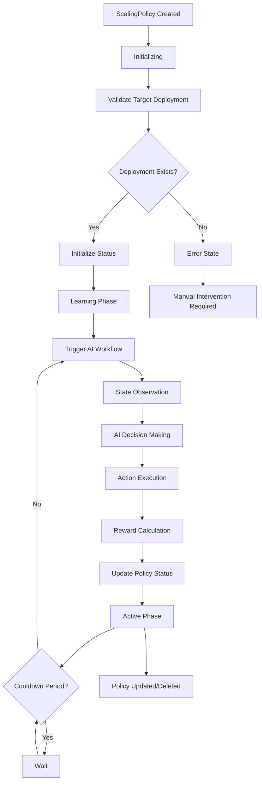

# NimbusGuard Operator Architecture

## Overview

The NimbusGuard LangGraph Operator follows **proper Kubernetes operator patterns** using the **Controller/Reconciliation Model** rather than simple event processing. This ensures reliability, consistency, and proper state management.

## Architecture Pattern

### ✅ **Controller Pattern (What We Implement)**
```
User Creates ScalingPolicy → Controller Reconciles → Ensures Desired State
         ↓                        ↓                        ↓
    Declarative API         Continuous Loop          Status Updates
```

### ❌ **Event-Driven Pattern (What We Avoided)**
```
Random Event → React → Hope It Works
```

## Core Components

### 1. **NimbusGuardController**
- **Main controller class** that manages AI-powered scaling policies
- Follows Kubernetes controller patterns with reconciliation loops
- Tracks both active policies and workflows
- Provides Prometheus metrics and health endpoints

### 2. **Reconciliation Loop**
```python
@kopf.on.create('nimbusguard.io', 'v1', 'scalingpolicies')
@kopf.on.update('nimbusguard.io', 'v1', 'scalingpolicies')  
@kopf.on.resume('nimbusguard.io', 'v1', 'scalingpolicies')
async def reconcile_scaling_policy(spec, status, name, namespace, uid):
    # Ensure actual state matches desired state
    return updated_status
```

### 3. **Status Management**
The controller properly updates CRD status fields:
- `phase`: Current policy phase (Initializing, Learning, Active, Paused, Error)
- `currentReplicas`: Current deployment replica count
- `targetReplicas`: Target replica count from last decision
- `lastScalingTime`: Timestamp of last scaling action
- `lastDecision`: Details of the most recent AI decision
- `metrics`: Performance metrics (total decisions, success rate, etc.)
- `conditions`: Array of status conditions for debugging

## State Machine



## Key Improvements

### **1. Proper Controller Pattern**

**Before (Event-driven):**
```python
@kopf.on.event('apps', 'v1', 'deployments')
async def handle_any_deployment_event():
    # React to random events
    maybe_trigger_scaling()
```

**After (Controller/Reconciliation):**
```python
@kopf.on.create('nimbusguard.io', 'v1', 'scalingpolicies')
async def create_scaling_policy(spec, status, name, namespace, uid):
    # Reconcile desired state vs actual state
    return await controller.reconcile_scaling_policy(...)
```

### **2. Status Reporting**

**Before:**
- No status updates
- No visibility into operator state
- Hard to debug issues

**After:**
```yaml
status:
  phase: "Active"
  currentReplicas: 3
  targetReplicas: 5
  lastScalingTime: "2024-01-15T10:30:00Z"
  lastDecision:
    action: "scale_up"
    confidence: 0.85
    reasoning: "CPU utilization above threshold"
  conditions:
    - type: "Ready"
      status: "True"
      reason: "PolicyActive"
```

### **3. Error Handling & Retry**

**Proper kopf error handling:**
```python
if not controller_ready:
    raise kopf.TemporaryError("Controller not ready", delay=10)
```

**Graceful degradation:**
```python
try:
    deployment = k8s_api.read_namespaced_deployment(...)
except ApiException as e:
    if e.status == 404:
        return await update_policy_status("Error", 
                                        f"Target deployment not found")
```

### **4. Idempotent Operations**

- Safe to run multiple times
- No duplicate scaling actions
- Cooldown period enforcement
- Proper state tracking

## AI Workflow Integration

The controller maintains the sophisticated AI workflow while adding proper Kubernetes patterns:

```
Reconciliation Trigger → Policy Validation → Cooldown Check → Start AI Workflow
                                                                       ↓
State Observation ← Reward Calculation ← Action Execution ← AI Decision Making
        ↓                     ↓                  ↓               ↓
    Collect Metrics    Update Q-Learning    Scale Deployment   Use Q-Learning
                                                                       ↓
                               Update Policy Status ← Workflow Complete
```

## Metrics and Observability

### **Prometheus Metrics**
- `nimbusguard_policies_total`: Total scaling policies created
- `nimbusguard_active_policies`: Current active policies
- `nimbusguard_policies_by_phase`: Policies by phase
- `nimbusguard_workflows_total`: Total workflows executed
- `nimbusguard_workflows_successful_total`: Successful workflows
- `nimbusguard_scaling_actions_total`: Total scaling actions
- `nimbusguard_q_learning_epsilon`: Current Q-learning epsilon value

### **Health Endpoints**
- `/healthz`: Liveness probe
- `/readyz`: Readiness probe  
- `/metrics`: Prometheus metrics

## Usage Example

### 1. **Create a ScalingPolicy**
```yaml
apiVersion: nimbusguard.io/v1
kind: ScalingPolicy
metadata:
  name: consumer-workload-ai-scaling
spec:
  target:
    apiVersion: apps/v1
    kind: Deployment
    name: consumer-workload
  scaling:
    minReplicas: 1
    maxReplicas: 10
    cooldownPeriod: 300
  aiConfig:
    qLearning:
      learningRate: 0.1
      epsilonStart: 1.0
      epsilonEnd: 0.01
```

### 2. **Monitor Status**
```bash
kubectl get scalingpolicy consumer-workload-ai-scaling -o yaml
```

### 3. **Check Operator Logs**
```bash
kubectl logs -l app.kubernetes.io/name=nimbusguard-operator -f
```

## Benefits of Controller Pattern

### **Reliability**
- Continuous reconciliation ensures consistency
- Automatic error recovery
- Proper status reporting

### **Observability** 
- Clear status fields
- Comprehensive metrics
- Structured logging

### **Maintainability**
- Follows Kubernetes conventions
- Easier to debug and extend
- Clear separation of concerns

### **Integration**
- Works with kubectl and other K8s tools
- Proper RBAC integration
- GitOps friendly

## Technical Implementation Details

### **Reconciliation Logic**
1. **Policy Tracking**: Maintain `active_policies` dictionary
2. **Deployment Validation**: Verify target deployment exists
3. **Cooldown Enforcement**: Respect scaling cooldown periods
4. **Workflow Management**: Start AI workflows when needed
5. **Status Updates**: Continuously update policy status

### **Error Scenarios**
- **Target Not Found**: Update policy status to "Error"
- **API Failures**: Use kopf temporary errors for retry
- **Workflow Failures**: Mark policy as failed with details
- **Configuration Issues**: Report in policy conditions

This architecture ensures the NimbusGuard operator is production-ready and follows Kubernetes best practices while maintaining the sophisticated AI-powered scaling capabilities. 