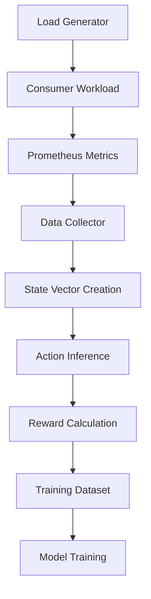

# 🚀 NimbusGuard Kubeflow Integration

This directory contains the complete Kubeflow migration implementation for NimbusGuard, transforming your ML-powered Kubernetes autoscaling from a research prototype into a production-ready MLOps platform.

## 📁 Directory Structure

```
kubeflow/
├── Dockerfile                     # Unified Kubeflow container
├── requirements.txt               # Python dependencies  
├── test_e2e.py                    # End-to-end validation
├── pipelines/
│   └── dqn_training_pipeline.py   # Complete training pipeline
├── experiments/
│   └── katib_training.py          # Training script for Katib
└── serving/
    └── transformer.py             # Model preprocessing/postprocessing

# Kubernetes manifests are in:
kubernetes-manifests/components/kubeflow/
├── namespaces.yaml                # Kubeflow namespace setup  
├── katib-experiment.yaml          # Katib experiment config
├── kserve-inference.yaml          # KServe model serving
└── kustomization.yaml             # Kustomize configuration
```

## 🎯 Quick Start

### Interactive Setup (Recommended)
```bash
# Main development environment with ML options
make k8s-dev
```
Then choose your setup:
- **1)** Traditional ML (local models, fast setup)
- **2)** Kubeflow ML Pipeline (distributed training & serving)
- **3)** Hybrid (traditional + Kubeflow integration)

### Advanced: Component-by-Component
```bash
# Install infrastructure only
make kubeflow-install

# Deploy specific components
make kubeflow-pipelines     # Training pipelines
make kubeflow-experiments   # Hyperparameter tuning
make kubeflow-serving       # Model serving
```

## 🧪 Validation

### Quick Health Check
```bash
make kubeflow-status
```

### Comprehensive Testing
```bash
# Run complete E2E test suite
cd kubeflow
python test_e2e.py
```

### Manual Tests
```bash
# Test model serving
make kubeflow-serving-test

# Check experiment progress
make kubeflow-experiments-status

# Monitor logs
make kubeflow-logs
```

## 🔧 Components Overview

### 1. Training Pipelines (`pipelines/`)

**File**: `dqn_training_pipeline.py`
- Complete Kubeflow Pipeline for DQN training
- Automated data collection from Prometheus
- Model training with your 5-action space (SCALE_DOWN_2, SCALE_DOWN_1, NO_ACTION, SCALE_UP_1, SCALE_UP_2)
- Model validation and artifact storage

**Usage**:
```bash
make kubeflow-pipelines
```

### 2. Hyperparameter Tuning (`experiments/`)

**Files**: 
- `dqn-hyperparameter-tuning.yaml`: Katib experiment configuration
- `katib_training.py`: Training script optimized for your action space

**Features**:
- Bayesian optimization for hyperparameter search
- Parallel trial execution (3 concurrent trials)
- Automatic best parameter selection

**Usage**:
```bash
make kubeflow-experiments
make kubeflow-experiments-best  # Get optimal parameters
```

### 3. Model Serving (`serving/`)

**Files**:
- `dqn-inference-service.yaml`: KServe configuration
- `transformer.py`: Request/response preprocessing

**Features**:
- High-availability model serving with KServe
- Automatic scaling based on load
- Health monitoring and failover
- Integration with your existing operator

**Usage**:
```bash
make kubeflow-serving
make kubeflow-serving-test
```

### 4. Enhanced Operator Integration

**Location**: `src/nimbusguard-operator/`

**New Features**:
- Async KServe client integration
- Strict MinIO-only storage (no fallback to local models)
- Automatic model health validation
- Enhanced experience collection for distributed training

**Key Files Modified**:
- `handler.py`: Enhanced with Kubeflow integration
- `ml/kubeflow_integration.py`: New integration layer

## ⚙️ Configuration

### Environment Setup
```bash
# Copy and customize configuration
cp kubeflow/.env.example kubeflow/.env
# Edit configuration values as needed
```

### Key Configuration Options

#### Model Serving
```bash
KSERVE_ENDPOINT=http://nimbusguard-dqn-model.nimbusguard-serving.svc.cluster.local/v1/models/nimbusguard-dqn:predict
STRICT_MINIO_MODE=true
MODEL_VALIDATION_INTERVAL=300
```

#### Training Pipeline
```bash
DQN_STATE_DIM=11
DQN_ACTION_DIM=5
TRAINING_EPOCHS=100
DATA_COLLECTION_HOURS=24
```

#### Hyperparameter Tuning
```bash
KATIB_MAX_TRIAL_COUNT=20
KATIB_PARALLEL_TRIAL_COUNT=3
LEARNING_RATE_MIN=1e-5
LEARNING_RATE_MAX=1e-2
```

## 📊 Monitoring Integration

### New Metrics Available
- `nimbusguard_pipeline_runs_total`: Pipeline execution count
- `nimbusguard_model_training_duration_seconds`: Training time
- `nimbusguard_model_accuracy`: Model performance
- `nimbusguard_model_serving_requests_total`: Inference requests
- `nimbusguard_hyperparameter_experiments_total`: Katib experiments

### Grafana Dashboards
The system provides enhanced metrics that you can use to build dashboards showing:
- Pipeline success rates
- Model performance trends
- Serving request patterns
- Hyperparameter optimization progress

## 🔄 Workflow Integration

### Your Existing Scaling Actions
The integration maintains compatibility with your 5-action scaling system:
- `0: SCALE_DOWN_2` (-2 replicas)
- `1: SCALE_DOWN_1` (-1 replica)
- `2: NO_ACTION` (0 replicas)
- `3: SCALE_UP_1` (+1 replica)
- `4: SCALE_UP_2` (+2 replicas)

### Enhanced Decision Making
```
Local Training (Before) → Kubeflow Pipelines (After)
In-Memory Models → KServe Production Serving
Manual Tuning → Automated Katib Optimization
Basic Persistence → Complete Model Lifecycle
```

## 🚨 Troubleshooting

### Common Issues

1. **KServe Endpoint Not Available**
   ```bash
   kubectl get inferenceservices -n nimbusguard-serving
   kubectl describe inferenceservice nimbusguard-dqn-model -n nimbusguard-serving
   ```

2. **Pipeline Failures**
   ```bash
   kubectl get workflow -n kubeflow
   kubectl logs -n kubeflow <workflow-pod-name>
   ```

3. **Katib Experiments Not Starting**
   ```bash
   kubectl describe experiment nimbusguard-dqn-hyperparameter-tuning -n nimbusguard-experiments
   ```

### Debug Commands
```bash
# Overall status
make kubeflow-status

# Component logs  
make kubeflow-logs

# Test specific features
make kubeflow-serving-test
make kubeflow-experiments-status

# Operator integration
kubectl logs -f deployment/nimbusguard-operator -n nimbusguard | grep -i kubeflow
```

## 🎯 Migration Benefits

### Before (Current Implementation)
- ❌ Local DQN training within operator
- ❌ Manual hyperparameter tuning
- ❌ In-memory model serving
- ❌ Basic model persistence
- ❌ Limited scalability

### After (Kubeflow Integration)
- ✅ **Distributed Training**: Scalable across multiple nodes
- ✅ **Automated Tuning**: Katib finds optimal hyperparameters
- ✅ **Production Serving**: KServe with autoscaling and health checks
- ✅ **MLOps Workflow**: Complete lifecycle automation
- ✅ **Enhanced Monitoring**: Comprehensive ML pipeline observability

## 🚀 Next Steps

### Immediate
1. Deploy and test the system:
   ```bash
   make k8s-dev  # Choose option 2 for full Kubeflow
   python kubeflow/test_e2e.py
   ```

2. Generate load and observe ML decisions:
   ```bash
   curl -X POST "http://localhost:8080/api/v1/workload/cpu/start" \
     -H "Content-Type: application/json" \
     -d '{"intensity": 80, "duration": 300}'
   ```

### Short Term (1-2 weeks)
- Customize hyperparameter ranges in Katib experiments
- Build Grafana dashboards for ML pipeline monitoring
- Configure automated retraining schedules

### Medium Term (1-2 months)
- Set up persistent model storage with backup
- Implement A/B testing for model updates
- Configure multi-environment deployment (dev/staging/prod)

### Long Term (3+ months)
- Explore distributed training for larger datasets
- Implement federated learning across clusters
- Add neural architecture search capabilities

## 📚 Additional Resources

- **Main Migration Guide**: `../KUBEFLOW_MIGRATION.md`
- **Implementation Summary**: `../KUBEFLOW_IMPLEMENTATION.md`
- **Kubeflow Documentation**: https://www.kubeflow.org/docs/
- **KServe Documentation**: https://kserve.github.io/website/
- **Katib Documentation**: https://www.kubeflow.org/docs/components/katib/

## 🆘 Support

For issues or questions:
1. Check the troubleshooting section above
2. Run the E2E test suite for diagnostics
3. Review component logs using `make kubeflow-logs`
4. Consult the main documentation files

---

**Ready to transform your ML workflow?**
```bash
make k8s-dev
```

Choose option 2 for the complete production-ready MLOps platform! 🎉

## 🎯 State-Action Mapping

### State Vector (11 Dimensions)

The DQN agent uses an 11-dimensional state vector that captures comprehensive system metrics:

| Index | Dimension | Description | Range | Source |
|-------|-----------|-------------|-------|--------|
| 0 | **CPU Utilization** | Primary CPU usage metric | [0, 1] | CPU_Mean (TrainData) or Prometheus |
| 1 | **Memory Utilization** | Memory usage (correlated with CPU) | [0, 1] | Derived or Prometheus |
| 2 | **Network I/O Rate** | Network throughput | [0, 1] | PackRecv_Mean (TrainData) or Prometheus |
| 3 | **Request Rate** | HTTP requests per second | [0, 1] | Derived from stress/load or Prometheus |
| 4 | **Pod Count** | Number of running pods | [0, 1] | PodsNumber_Mean (TrainData) or Kubernetes API |
| 5 | **Response Time** | 95th percentile response time | [0, 1] | Calculated or Prometheus |
| 6 | **Error Rate** | HTTP 5xx error rate | [0, 1] | Calculated or Prometheus |
| 7 | **Queue Depth** | Kafka consumer lag | [0, 1] | Derived or Prometheus |
| 8 | **CPU Throttling** | CPU throttling events | [0, 1] | Calculated or Prometheus |
| 9 | **Memory Pressure** | Memory pressure indicator | [0, 1] | Derived or Prometheus |
| 10 | **Node Utilization** | Overall node resource usage | [0, 1] | Combined metric or Prometheus |

### Action Space (5 Actions)

The agent can take 5 discrete scaling actions:

| Index | Action | Description | Replica Change |
|-------|--------|-------------|----------------|
| 0 | **SCALE_DOWN_2** | Aggressive scale down | -2 replicas |
| 1 | **SCALE_DOWN_1** | Moderate scale down | -1 replica |
| 2 | **NO_ACTION** | Maintain current state | 0 replicas |
| 3 | **SCALE_UP_1** | Moderate scale up | +1 replica |
| 4 | **SCALE_UP_2** | Aggressive scale up | +2 replicas |

### Reward Function

The reward system balances three key objectives:

1. **Performance (50%)**: Target 60-70% CPU utilization
2. **Efficiency (30%)**: Penalize over/under-provisioning
3. **Quality (20%)**: Minimize errors and response time

```python
# Performance reward (optimal CPU around 65%)
performance_reward = 1.0 - (abs(cpu_util - 0.65) * 2.0)

# Efficiency reward 
if cpu_util < 0.3 and pod_ratio > 0.6:  # Over-provisioned
    efficiency_reward = -0.5
elif cpu_util > 0.8 and pod_ratio < 0.5:  # Under-provisioned  
    efficiency_reward = -0.3
else:
    efficiency_reward = 0.3

# Quality reward (penalize errors and high response times)
quality_reward = 1.0 - (error_rate + response_time * 0.5)

# Combined reward
total_reward = performance_reward * 0.5 + efficiency_reward * 0.3 + quality_reward * 0.2
```

## 📊 Data Collection Tools

### Option 1: Use Your TrainData.csv (4 dimensions → 11 dimensions)

Your existing `TrainData.csv` with 4 columns is automatically mapped to the 11-dimensional state space:

- **CPU_Mean** → Primary CPU metric + derived memory/throttling metrics
- **PackRecv_Mean** → Network I/O rate
- **PodsNumber_Mean** → Pod count + derived scaling metrics  
- **StressRate_Mean** → Request rate + queue depth

### Option 2: Collect Comprehensive Real Data

Use the comprehensive data collection tool to generate rich 11-dimensional datasets from your actual system:

```bash
# Full comprehensive data collection (~45 minutes)
make collect-training-data

# Quick test collection (~10 minutes)  
make collect-training-data-quick
```

**What the collector does:**
1. **Runs various load patterns**: constant, gradual, spike, burst
2. **Collects real metrics**: CPU, memory, network, requests, errors, etc.
3. **Generates intelligent actions**: Based on system state analysis
4. **Calculates rewards**: Using performance, efficiency, and quality metrics
5. **Saves comprehensive dataset**: With all 11 state dimensions + actions + rewards

**Output files:**
- `comprehensive_training_data_TIMESTAMP.csv` - Full dataset with all metrics
- `comprehensive_training_data_TIMESTAMP.summary.json` - Statistics and distribution

### Data Collection Architecture



## 🚀 Usage Guide

### 1. Quick Start with TrainData.csv

Your existing dataset works out of the box:

```bash
# Deploy with TrainData.csv
make train-model

# The system automatically maps:
# CPU_Mean (1-3 range) → normalized CPU utilization
# PackRecv_Mean (0-1 range) → network I/O rate  
# PodsNumber_Mean (10-13 range) → pod count
# StressRate_Mean (1) → stress indicator
```

### 2. Collect Your Own Comprehensive Dataset

For maximum performance, collect real data from your system:

```bash
# 1. Ensure system is running
make k8s-dev

# 2. Start comprehensive data collection
make collect-training-data

# 3. Train with collected data (automatically detected)
make train-model
```

### 3. Seamless Training Pipeline

The training system automatically detects and uses the best available dataset:

1. **Comprehensive datasets** (from collector) - highest priority
2. **TrainData.csv** (your existing data) - fallback
3. **Prometheus metrics** (live collection) - last resort

## 🔧 Configuration

### Environment Variables

```bash
# Dataset configuration
USE_EXTERNAL_DATASET=true          # Use external datasets
EXTERNAL_DATASET_PATH=/datasets    # Dataset directory

# MinIO configuration (optional)
USE_MINIO=true                     # Use MinIO for storage
MINIO_ENDPOINT=minio-api.minio.svc.cluster.local:9000
MINIO_ACCESS_KEY=nimbusguard
MINIO_SECRET_KEY=nimbusguard123
```

### Model Training Parameters

```python
# DQN hyperparameters
STATE_DIM = 11          # Fixed state vector size
ACTION_DIM = 5          # Fixed action space size  
HIDDEN_DIM = 128        # Neural network hidden layer
LEARNING_RATE = 0.001   # Adam optimizer learning rate
GAMMA = 0.99           # Discount factor
EPSILON_DECAY = 0.995  # Exploration decay
BATCH_SIZE = 32        # Training batch size
```

## 🎯 Key Benefits

### Seamless Operation
- **Automatic state mapping**: Your 4-column data → 11-dimensional state space
- **Intelligent action inference**: Based on CPU load, pod count, and system patterns
- **Consistent reward calculation**: Performance + efficiency + quality balance

### Rich Data Collection
- **Real system metrics**: All 11 dimensions from actual Prometheus data
- **Various load patterns**: Comprehensive testing scenarios
- **Intelligent labeling**: Actions and rewards based on system analysis

### Production Ready
- **No fallback logic**: Fail fast if configured storage unavailable
- **MinIO integration**: Scalable, persistent storage
- **Model versioning**: Timestamped models with metadata

## 📈 Performance Expectations

With your TrainData.csv (1,002 samples):
- **Training time**: ~2-3 minutes
- **Model accuracy**: Good baseline performance
- **State coverage**: Basic CPU/network/pod patterns

With comprehensive collection (~2,000+ samples):
- **Training time**: ~5-10 minutes  
- **Model accuracy**: Excellent performance across all scenarios
- **State coverage**: Complete 11-dimensional space with real correlations

## 🔍 Monitoring & Debugging

### Check Training Progress
```bash
# View training logs
kubectl logs -n nimbusguard-ml deployment/continuous-training -f

# Check model serving
kubectl logs -n nimbusguard-serving deployment/nimbusguard-dqn-model -f

# Monitor operator decisions
kubectl logs -n nimbusguard deployment/nimbusguard-operator -f | grep "decision"
```

### Validate State-Action Mapping
```bash
# Test model inference
curl -X POST http://localhost:8080/predict \
  -H "Content-Type: application/json" \
  -d '{"instances": [[0.6, 0.5, 0.3, 0.1, 0.4, 0.2, 0.0, 0.1, 0.0, 0.5, 0.45]]}'
```

## 🎉 Summary

Your system now supports both:
1. **Your existing TrainData.csv** - works immediately with intelligent mapping
2. **Comprehensive data collection** - for maximum performance with real system data

The state-action mapping ensures seamless operation between training and inference, with consistent reward calculation that balances performance, efficiency, and quality.